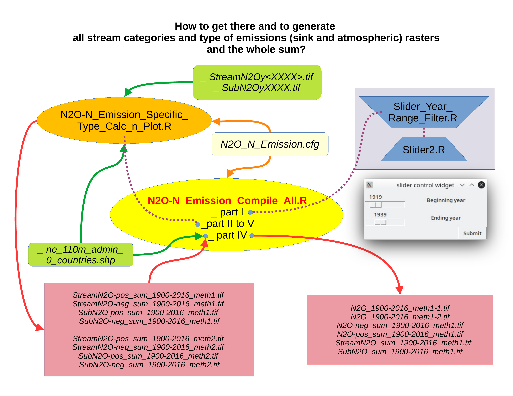
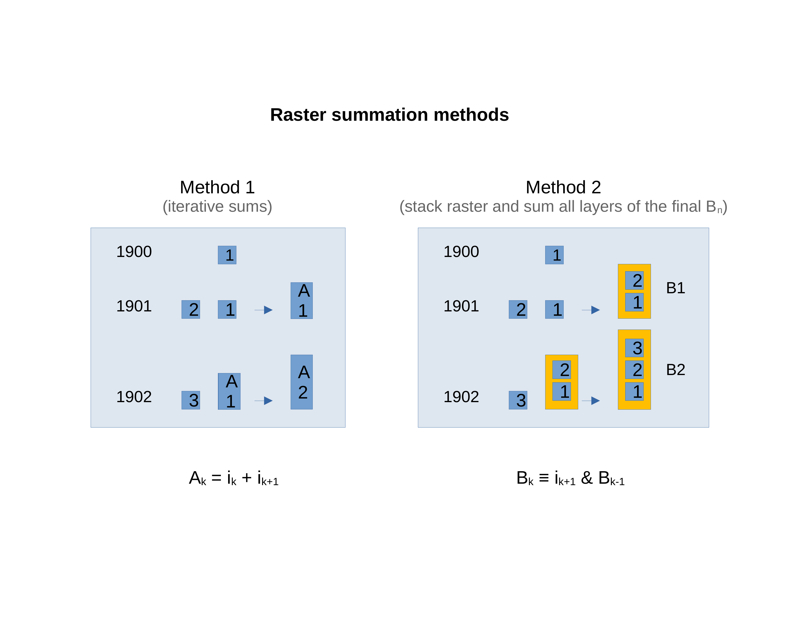
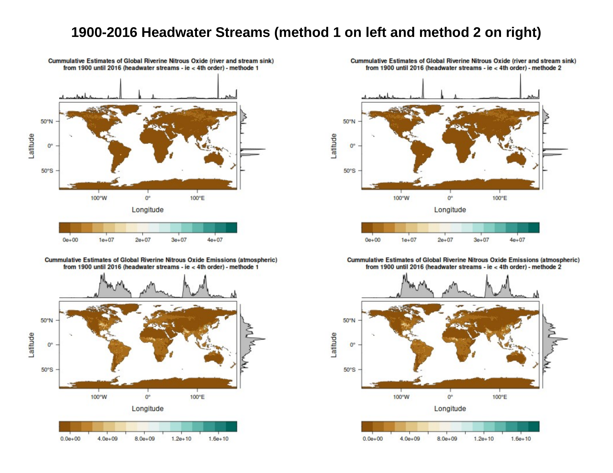
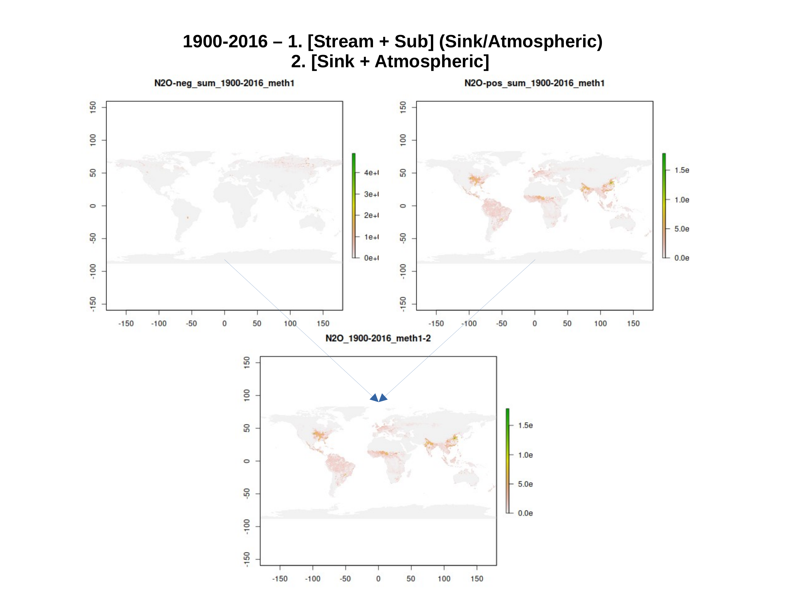

# 🌍 Global Riverine N₂O Emissions Processor

This project provides an R-based processing pipeline to analyze nitrous oxide (N₂O) emissions from global riverine systems using raster datasets. It leverages data from the [CMS: Global Riverine N₂O Emissions, 1900–2016](https://daac.ornl.gov/CMS/guides/Global_Riverine_N2O_Emissions.html) dataset.

---

## 📁 Project Structure

```text
📦 Global-Riverine-N2O-Emissions-Processor
├── N2O-N_Emission_Compile_All.R
│   └─ Main driver script: orchestrates data loading, filtering, plotting, and final outputs.
│
├── N2O-N_Emission_Specific_Type_Calc_n_Plot.R
│   └─ Called by main script to handle raster operations per emission category and stream order.
│
├── N2O_N_Emission.cfg
│   └─ Configuration file to define parameters (years, thresholds, paths, OS).
│
├── Slider_Year_Range_Filter.R
│   └─ Interactive year-range selector used in the main script.
│
└── /output/
    └─ Raster outputs (GeoTIFF, PNG) and cumulative summaries

```

## 🛠️ What the Script Does

### 📌 Purpose

To summarize and compare annual riverine N₂O emissions (positive and negative fluxes) for headwater and higher-order streams using two aggregation methods. Outputs are visualized and saved as both maps and raster files.

---

### 🔄 Workflow

1. **Configuration Load & Setup**  
   Detects OS, working directory, and reads user-defined parameters from `.cfg`.

2. **Year Selection**  
   Uses `Slider_Year_Range_Filter.R` to select a year range from 1900 to 2016.

3. **Raster Processing per Type**  
   For each combination of stream order and emission category:
   - Filters raster values by thresholds  
   - Masks data using country shapefiles  
   - Aggregates rasters over selected years using two methods

4. **Plotting & Comparison**  
   Visualizes yearly and cumulative emissions using both `rasterVis` (levelplots) and base R maps.

5. **Final Output**  
   Saves results as GeoTIFFs and PNGs (individual and comparison plots) to `output/FINAL/`.

---

## 🖼️ Figures & Results

Below are key output charts from the analysis comparing methods and emission categories:

### 📊 Methodology & Comparison Charts

#### 🧭 Processing Workflow
<p align="left">
  <a href="figures/slide-02.png">
    
  </a>
</p>

#### 📈 Raster summation methods

<p align="left">
  <a href="figures/slide-03.png">
    
  </a>
</p>

### 📈 Visual comparison both methods

<p align="left">
  <a href="figures/slide-09.png">
    
  </a>
</p>

### 📈 Visual summation 2 categoris emissions method 1
<p align="left">
  <a href="figures/slide-11.png">
    
  </a>
</p>

### 


---

## 📚 Reference

- Tian et al., *Annual Estimates of Global Riverine Nitrous Oxide Emissions*, ORNL DAAC.  
  [🔗 Data Source](https://daac.ornl.gov/CMS/guides/Global_Riverine_N2O_Emissions.html)

---

## 📦 Requirements

This R project requires the following packages:
- `raster`, `sf`, `rasterVis`, `rgdal`, `lattice`, `colorRamps`, `RColorBrewer`, `hms` 
